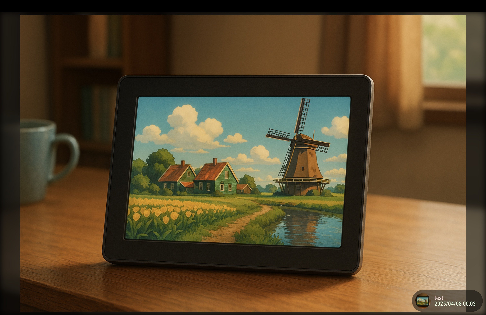

# MMM-OneDrive

Display your photos from album of OneDrive on [MagicMirror²](https://github.com/MagicMirrorOrg/MagicMirror). Inspired by [MMM-GooglePhotos](https://github.com/hermanho/MMM-GooglePhotos).

## Screenshot



## Installation & Upgrade

[INSTALL.md](INSTALL.md)

## OpenCV Dependency for Face Detection

The face detection feature requires **OpenCV 4.x** with DNN (Deep Neural Network) support and **opencv4nodejs** Node.js bindings. This is a complex setup due to native compilation requirements.

### Quick Start (if you just want face detection working)

If your system already has the build scripts from this repo:

```bash
# For Raspberry Pi 5 (full OpenCV build pipeline)
./clean_opencv.sh          # Step 1: Clean system
./sync-opencv.sh            # Step 2: Download OpenCV source  
./build_opencv.sh           # Step 3: Build OpenCV with DNN support
./install_opencv4nodejs.sh  # Step 4: Install Node.js bindings
./rebuild_opencv_for_electron.sh  # Step 5: Fix Electron compatibility
```

### Why This Is Complex

Face detection uses advanced OpenCV features that require:

1. **Custom OpenCV Build**: System package managers (apt/yum) don't include DNN module by default
2. **Native Compilation**: opencv4nodejs contains native code that must match your Node.js/Electron version exactly
3. **Electron ABI Compatibility**: MagicMirror runs on Electron, not regular Node.js, requiring special rebuild steps

### Build Scripts Reference

All build scripts are included in this repository. Run them in order for a complete setup:

#### Pi5/ARM64 Build Pipeline

| Script | Purpose | Gotchas |
|--------|---------|---------|
| `clean_opencv.sh` | **Step 1**: Remove all existing OpenCV installations | • Removes system packages, pip installs, and source builds<br>• Required for clean build<br>• May affect other OpenCV projects |
| `sync-opencv.sh` | **Step 2**: Download OpenCV 4.x source code | • Downloads ~500MB of source<br>• Uses latest 4.x branch for compatibility<br>• Requires good internet connection |
| `build_opencv.sh` | **Step 3**: Compile OpenCV with DNN support | • Takes 2-4 hours on Pi5<br>• Requires 8GB+ free space<br>• May fail on memory constraints<br>• Optimized for ARM64 architecture |
| `install_opencv4nodejs.sh` | **Step 4**: Install Node.js bindings | • Links to custom OpenCV build<br>• Specific to @u4/opencv4nodejs v7.1.2<br>• May need canvas/sharp native dependencies |
| `validate_opencv4nodejs.sh` | **Validation**: Test Node.js bindings | • Tests actual face detection methods<br>• Verifies DNN support<br>• Safe to run multiple times |
| `validate_opencv_dnn.sh` | **Validation**: Test DNN module | • Low-level OpenCV DNN verification<br>• Checks for essential modules |

#### Electron Compatibility Fix

| Script | Purpose | When to Use |
|--------|---------|-------------|
| `rebuild_opencv_for_electron.sh` | **Critical**: Rebuild opencv4nodejs for Electron | • **Must run after any MagicMirror/Electron update**<br>• Fixes "Module did not self-register" errors<br>• Auto-detects Electron version<br>• Uses `npx @electron/rebuild` command |

### WSL/x64 Alternative

| Script | Purpose | Platform |
|--------|---------|----------|
| `BuildOpenCVOnWSL.sh` | Complete OpenCV build for WSL2/Ubuntu | WSL2, Ubuntu x64 systems |

### Common Issues & Solutions

**❌ "Module did not self-register" Error**
```bash
# opencv4nodejs was compiled for wrong Node.js/Electron version
./rebuild_opencv_for_electron.sh
```

**❌ "DNN module not available" Error**  
```bash
# OpenCV built without DNN support
./build_opencv.sh  # Rebuild with DNN enabled
```

**❌ "Cannot find opencv4nodejs" Error**
```bash
# Missing Node.js bindings
./install_opencv4nodejs.sh
```

**❌ Build fails with memory errors**
```bash
# Reduce parallel jobs in build_opencv.sh
# Or add swap space: sudo fallocate -l 4G /swapfile
```

### Face Detection Features

Once properly installed, face detection provides:

- **YOLO v8 Face Detection**: High accuracy primary method
- **Haar Cascade Fallback**: Reliable backup detection  
- **Interest Point Detection**: Fallback when no faces found
- **Debug Mode**: Visual bounding rectangles when `debugMode: true`
- **Ken Burns Integration**: Intelligent focal points for photo transitions

### Maintenance Notes

- **Fragile Dependency**: opencv4nodejs breaks on Node.js/Electron version changes
- **Keep Rebuild Script Handy**: Bookmark `rebuild_opencv_for_electron.sh` 
- **Update Considerations**: Test face detection after any MagicMirror updates
- **Alternative Approach**: Consider opencv-wasm for zero-maintenance (but slower performance)

### Performance

- **Face Detection Time**: ~700-800ms per photo on Pi5
- **Build Time**: 2-4 hours for complete OpenCV build
- **Disk Space**: ~8GB during build, ~2GB after cleanup
- **Memory**: 4GB+ recommended during build

## Configuration

```javascript
{
  module: "MMM-OneDrive",
  position: "top_right",
  config: {
    albums: [], // Set your album name. like ["My wedding", "family share", "Travle to Paris"]
    folders: [], // NEW: Set your folder paths. like ["Photos/2024", "Camera Roll", "Screenshots"]
    updateInterval: 1000 * 60, // minimum 10 seconds.
    sort: "new", // "old", "random"
    condition: {
      fromDate: null, // Or "2018-03", RFC ... format available
      toDate: null, // Or "2019-12-25",
      minWidth: null, // Or 400
      maxWidth: null, // Or 8000
      minHeight: null, // Or 400
      maxHeight: null, // Or 8000
      minWHRatio: null,
      maxWHRatio: null,
      // WHRatio = Width/Height ratio ( ==1 : Squared Photo,   < 1 : Portraited Photo, > 1 : Landscaped Photo)
    },
    showWidth: 1080, // These values will be used for quality of downloaded photos to show. real size to show in your MagicMirror region is recommended.
    showHeight: 1920,
    timeFormat: "YYYY/MM/DD HH:mm", // Or `relative` can be used.
    forceAuthInteractive: false, // Force interactive authorization
  }
},
```

### `albums`

Now this module can access not only your owns but also shared. You can specify album title like this.

```js
albums: ["My wedding", "family share", "Travle to Paris", "from Tom"],
```

- Caution. Too many albums and photos could make long bootup delay.
- Remember this. You can only show max 8640 photos in a day. Manage your album what to show, it will make better performance.

### `folders` (NEW)

You can now access photos from regular OneDrive folders in addition to albums. This works with both personal OneDrive and OneDrive for Business. You can specify folder names or paths:

```js
folders: [
  "Photos/2024",           // Path-based access
  "Camera Roll",           // Folder name matching
  "Screenshots",           // Root-level folder
  "Family Photos/Vacation" // Nested folder path
],
```

**Folder vs Album differences:**
- **Albums** are special OneDrive photo collections (bundles) - only available in personal OneDrive
- **Folders** are regular file system folders - work with both personal OneDrive and OneDrive for Business
- You can use both `albums` and `folders` together in the same configuration
- Folder paths use forward slashes (`/`) regardless of your operating system

### `updateInterval`

- Minimum `updateInterval` is 10 seconds. Too often update could makes API quota drains or network burden.

### `sort`

- `new`, `old`, `random` are supported.

### `condition`

- You can filter photos by this object.
- `fromDate` : If set, The photos which was created after this value will be loaded. (e.g: `fromDate:"2015-12-25"` or `fromDate:"6 Mar 17 21:22 UT"`)
- `toDate` : If set, The photos which was created before this value will be loaded. (e.g: `toDate:"Mon 06 Mar 2017 21:22:23 z"` or `toDate:"20130208"`)
- ISO 8601 and RFC 2822 is supported for `fromDate` and `toDate`.
- `minWidth`, `maxWidth`, `minHeight`, `maxHeight` : If set, the photos have these value as original dimensiont will be loaded. You can use these values to avoid too big or too small pictures(like icons)
- `minWHRatio`, `maxWHRatio` : With these values, you can get only portrait photos(or landscaped, or squared)
- **WHRatio** is `width / height`. So `=1` will be squared dimension. `>1` will be landscaped. `<1` will be portrait.
- Example:

```js
condition: {
  fromDate: "2018-01-01", // I don't want older photos than this.
  minWidth: 600, // I don't want to display some icons or meme-pictures from my garbage collecting albums.
  maxWHRatio: 1, // I want to display photos which are portrait.
}
```

### `showWidth`, `showHeight`

- Specify your real resolution to show.

### `timeFormat`

- Specify time format for photo info. You can also use `relative` to show more humanized.

### `debug`

- If set, more detailed info will be logged.

### `autoInfoPosition`

- For preventing LCD burning, Photo info can be relocated by condition.
  - `true` : automatically change position to each corner per 15 minutes.
  - `false` : not using.
  - callbackfunction (album, photo) : User can make his own position. It should return `[top, left, bottom, right]`

```js
autoInfoPosition: true, // or false

// User custom callback
autoInfoPosition: (album, photo)=> {
 return ['10px', '10px', 'none', 'none'] // This will show photo info top-left corner.
}

```

### scanInterval
- Optional value. How often (ms) to check OneDrive for new or updated photos. Default: `1000 * 60 * 55` (55 minutes). Lower values update more often but use more network/API.


## Toggle MMM-OneDrive module

To toggle next photos from other modules use the following codes:

```js
this.sendNotification('ONEDRIVE_PHOTO_NEXT', undefined);
```

## Tip

- Not to show photo info : Add this into your `css/custom.css`.

```css
#ONEDRIVE_PHOTO_INFO {
  display: none;
}
```

- To move photo info to other position (e.g: top-left corner): Add this into your `css/custom.css`.

```css
#ONEDRIVE_PHOTO_INFO {
  top: 10px;
  left: 10px;
  bottom: inherit;
  right: inherit;
}
```

- Not to show blurred Background : Add this into your `css/custom.css`.

```css
#ONEDRIVE_PHOTO_BACKDROP {
  display: none;
}
```

- To cover whole region with image : Add this into your `css/custom.css`.

```css
#ONEDRIVE_PHOTO_CURRENT {
  background-size: cover;
}
```

- To shrink image and be fully visible on smaller screens : Add this into your `css/custom.css`.

```css
#ONEDRIVE_PHOTO_CURRENT {
  background-size: contain;
}
```

- To display `clock` more clearly on showing in `fullscreen_below` : Add this into your `css/custom.css`.

```css
.clock {
  padding: 10px;
  background-color: rgba(0, 0, 0, 0.5);
}
```

- To give opacity to photos:

```CSS
@keyframes trans {
  from {opacity: 0}
  to {opacity: 0.5}
}
#ONEDRIVE_PHOTO_CURRENT {
  background-size:cover;
  opacity:0.5;
}
```

## Notice

- First scanning will take a few (~dozens) seconds. Don't panic.
- If there are 1000s of photos, this scan could take minutes(over 10). longer scans increase the probablity of an error happening. If a single error happens in the scan, it will retry after 1 hour. After first successful scan, subsequent startups should go very quickly(seconds).
-

## Last Tested

- node.js: required over v18.
- MagicMirror: v2.31.0
- Modules:
  - MMM-ModuleScheduler [https://github.com/ianperrin/MMM-ModuleScheduler]
  - MMM-MagicMover [https://github.com/Lavve/MMM-MagicMover]
